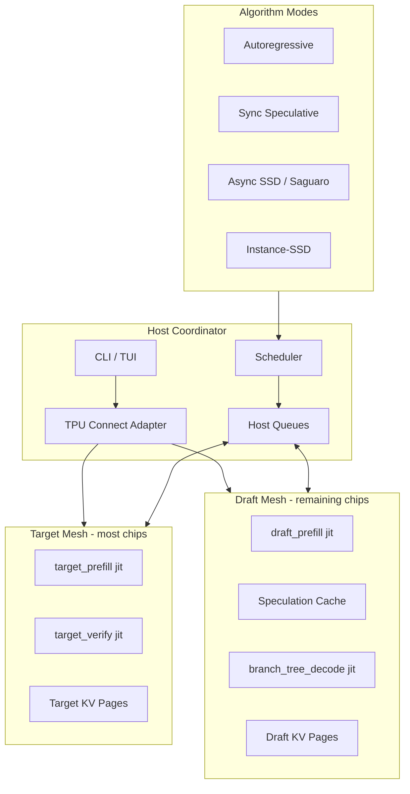
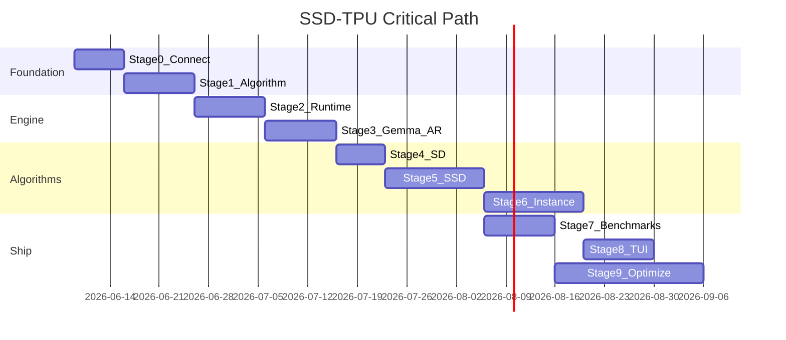

# SSD on Google TPU — Full Implementation Plan

## Current State

- Workspace [`ssd-tpu-`](c:\Users\Tinevimbo\ssd-tpu\ssd-tpu-) is **greenfield**: only [`context_files/`](c:\Users\Tinevimbo\ssd-tpu\ssd-tpu-\context_files) (reference docs) and [`.gitignore`](c:\Users\Tinevimbo\ssd-tpu\ssd-tpu-\.gitignore).
- Original CUDA implementation: [github.com/tanishqkumar/ssd](https://github.com/tanishqkumar/ssd) — PyTorch, H100, NCCL, Triton, FlashInfer, CUDA graphs.
- Your choices: **flexible TPU slice auto-partition** + **Gemma-first** milestone.

## Mental Model



**Core principle** (from [repo_summary_and_tpu_replication.md](c:\Users\Tinevimbo\ssd-tpu\ssd-tpu-\context_files\repo_summary_and_tpu_replication.md)): preserve the **algorithmic contract**, not CUDA mechanics. Port `verify.py` + cache semantics first; use MaxText/Gemma for model execution; bucket JIT shapes; add Pallas only after profiling.

---

## Proposed Repository Layout

Every top-level folder has a single responsibility. Nothing CUDA-specific lives here.

```text
ssd-tpu-/
├── README.md                    # Setup, TPU connect, quickstart, benchmark commands
├── pyproject.toml               # jax[tpu], flax, orbax, rich, textual, maxtext (optional extra)
├── uv.lock
├── .env.example                 # GCP_PROJECT, TPU_ZONE, SSH_HOST, MODEL_PATHS
├── .gitignore

├── connect/                     # TPU slice connection & device allocation
│   ├── __init__.py
│   ├── config.py                # Load .env / gcloud metadata
│   ├── ssh_tunnel.py            # Stable SSH port-forward for remote dev
│   ├── slice_probe.py           # jax.device_count(), chip topology probe
│   ├── mesh_allocator.py        # Auto-split devices → target_mesh + draft_mesh
│   └── diagnostics.py           # Wrap TPU Builders pre-flight script

├── jax_ssd/                     # Main inference package (public API)
│   ├── __init__.py              # Re-export LLM, SamplingParams, DecodeMode
│   ├── llm.py                   # Thin public class (like original ssd/llm.py)
│   ├── config.py                # Runtime config: K, fanout, meshes, buckets
│   ├── sampling_params.py       # temperature, max_tokens, eos
│   │
│   ├── algorithm/               # Pure algorithm — no model weights
│   │   ├── verify.py            # JAX port of ssd/utils/verify.py
│   │   ├── spec_cache.py        # Tensor-backed draft cache lookup
│   │   ├── branch_prior.py      # Top-F recovery token selection (Saguaro)
│   │   ├── instance_prior.py    # Instance-SSD: context span retrieval
│   │   └── async_protocol.py    # Request/response message types
│   │
│   ├── runtime/                 # Host-side orchestration
│   │   ├── engine.py            # LLMEngine: AR / SD / SSD / Instance modes
│   │   ├── scheduler.py         # Request queue, batching, preemption
│   │   ├── sequence.py          # Per-request token + page state
│   │   ├── page_manager.py      # Paged KV block allocation (host bookkeeping)
│   │   ├── workers.py           # TargetWorker + DraftWorker threads/processes
│   │   └── metrics.py           # tokens/s, hit rate, verify time, TTFT
│   │
│   ├── models/                  # Model adapters (hide MaxText/Gemma details)
│   │   ├── base.py              # DecodeModelAdapter interface
│   │   ├── gemma_adapter.py     # Phase 1: Gemma via google-gemma or MaxText
│   │   ├── qwen_adapter.py      # Phase 2 stub
│   │   └── toy_model.py         # Tiny decoder for parity tests (no weights)
│   │
│   ├── kernels/                 # JIT-compiled compute (start reference, optimize later)
│   │   ├── kv_cache.py          # Page write/gather via .at[].set()
│   │   ├── masks.py             # Branch/tree attention masks
│   │   ├── attention_ref.py     # Dense masked attention reference
│   │   └── buckets.py           # Shape bucket padding (replaces CUDA graphs)
│   │
│   └── benchmarks/              # Runnable benchmark entrypoints
│       ├── qa_smoke.py
│       ├── code_refactor.py
│       └── compare_ar_sd_ssd.py

├── tui/                         # Terminal UI for live algorithm comparison
│   ├── __init__.py
│   ├── app.py                   # Textual/Rich TUI main loop
│   ├── panels.py                # Side-by-side AR | SD | SSD | Instance panels
│   ├── token_anim.py            # Live decode: append each token as generated + blink cursor
│   └── theme.py

├── scripts/
│   ├── provision_tpu.sh         # gcloud FLEX_START templates (v6e/v5p/v5e)
│   ├── setup_tpu_vm.sh          # pip install jax[tpu], clone weights
│   ├── download_models.py       # HF → GCS/local cache
│   └── download_datasets.py     # GSM8K, HumanEval, custom refactor set

├── tests/
│   ├── test_verify_parity.py    # JAX vs PyTorch (vendored snippet from original repo)
│   ├── test_spec_cache.py
│   ├── test_page_rollback.py
│   ├── test_mesh_allocator.py
│   └── test_instance_prior.py

├── reference/                   # Optional git submodule: tanishqkumar/ssd
│   └── cuda_ssd/                # For parity tests only — not shipped in wheel

├── docs/
│   ├── architecture.md
│   ├── tpu_connect.md           # SSH + slice workflow for TPU Builders
│   ├── algorithms.md            # AR, SD, SSD, Instance-SSD explained
│   └── benchmarking.md

└── context_files/               # Your existing notes (gitignored, local only)
```

### Folder Purpose Summary

| Folder | Role |
|--------|------|
| [`connect/`](connect/) | **TPU infrastructure layer** — SSH tunnels, device probing, auto mesh split. Keeps inference code free of gcloud/SSH details. |
| [`jax_ssd/algorithm/`](jax_ssd/algorithm/) | **Lossless algorithm core** — verification, cache, branch/instance priors. Testable without real LLM weights. |
| [`jax_ssd/runtime/`](jax_ssd/runtime/) | **Inference engine** — scheduler, workers, host queues mirroring `ssd/engine/*`. |
| [`jax_ssd/models/`](jax_ssd/models/) | **Model backends** — Gemma-first adapters behind a stable interface. |
| [`jax_ssd/kernels/`](jax_ssd/kernels/) | **JIT compute** — KV pages, masks, bucketed shapes. Pallas goes here later if needed. |
| [`jax_ssd/benchmarks/`](jax_ssd/benchmarks/) | **Speed & correctness harness** — reproduces original `bench/bench.py` modes. |
| [`tui/`](tui/) | **Live demo UI** — four panels each showing **real decoded text** streaming token-by-token as generation happens, plus speed/cache metrics (your `tpu_builder_context.md` request). |
| [`reference/cuda_ssd/`](reference/cuda_ssd/) | **Parity oracle** — original PyTorch verify logic for tests, not runtime dependency. |

---

## Stage 0 — Repo Scaffold & TPU Connect (Week 1)

**Goal**: Empty repo becomes runnable on any TPU slice; `jax.device_count()` works via SSH.

### 0.1 Project bootstrap
- Add `pyproject.toml` with: `jax[tpu]`, `flax`, `numpy`, `orbax-checkpoint`, `transformers`, `huggingface-hub`, `rich`, `textual`, `python-dotenv`, `pytest`.
- Add `README.md` with TPU Builders workflow from [TPU Builders Getting Started Guide](c:\Users\Tinevimbo\ssd-tpu\ssd-tpu-\context_files\TPU%20Builders%20Getting%20Started%20Guide%20(1).md).

### 0.2 TPU Connect Adapter (`connect/`)

Design a **connector interface** so inference never hard-codes SSH or slice size:

```python
# connect/mesh_allocator.py (concept)
class TPUConnector:
    def probe(self) -> DeviceTopology
    def allocate_meshes(self, policy="auto") -> (target_mesh, draft_mesh)
    def health_check(self) -> bool
```

**Auto-partition policy** (flexible slices):
- `N = jax.device_count()`
- If `N >= 8`: target gets `N - max(1, N//8)` chips, draft gets remainder (min 1).
- If `N == 4`: target=3, draft=1 (mirrors original 4+1 H100 layout at smaller scale).
- If `N == 2`: target=1, draft=1 (sync-only SD/SSD with heavy host overlap; AR still works).
- If `N == 1`: AR + sync SD only; SSD degrades to sequential with warning.

**SSH stability** (`connect/ssh_tunnel.py`):
- Read `TPU_SSH_HOST`, `TPU_SSH_USER`, `JAX_PLATFORMS=tpu` from `.env`.
- Auto-reconnect wrapper for Remote-SSH sessions (per TPU Builders FAQ: Colab not supported; SSH + Jupyter is recommended).
- Expose `connect doctor` CLI: runs pre-flight diagnostic + `jax.devices()` smoke test.

### 0.3 Provisioning scripts
- [`scripts/provision_tpu.sh`](scripts/provision_tpu.sh): parameterized templates for v6e (`ct6e-standard-4t`), v5p (`ct5p-hightpu-4t`), v5e legacy queued resource.
- [`scripts/setup_tpu_vm.sh`](scripts/setup_tpu_vm.sh): `pip install -U "jax[tpu]" -f https://storage.googleapis.com/jax-releases/libtpu_releases.html`.

**Exit criteria**: `python -m connect.diagnostics` prints device count and allocated meshes on a live TPU VM.

---

## Stage 1 — Algorithm Core Without Models (Week 1–2)

**Goal**: Port the lossless heart of SSD before touching Gemma weights.

### 1.1 Verification (`jax_ssd/algorithm/verify.py`)
Direct port of original [`ssd/utils/verify.py`](https://github.com/tanishqkumar/ssd) logic:
- Inputs: `logits_p [B,K+1,V]`, `logits_q [B,K,V]`, `speculations [B,K+1]`, temperatures, cache-hit mask, `sampler_x`.
- Outputs (dense, JIT-safe): `accept_until [B]`, `recovery_tokens [B]`, `accepted_buffer [B,K+1]`.
- **Milestone 1a**: greedy-only.
- **Milestone 1b**: sampling + Saguaro `sampler_x` rescaling.

### 1.2 Speculation cache (`jax_ssd/algorithm/spec_cache.py`)
Tensor-backed cache matching CUDA layout:
- `cache_keys [num_branches, 3]` — `[seq_id, accepted_length_index, recovery_token_id]`
- `cache_tokens`, `cache_logits`, `cache_valid`
- Vectorized lookup via `jnp.all` + `argmax` (from [implementation plan](c:\Users\Tinevimbo\ssd-tpu\ssd-tpu-\context_files\ssd_tpu_jax_implementation_plan%20copy.md))

### 1.3 Branch prior (`jax_ssd/algorithm/branch_prior.py`)
Saguaro outcome prediction:
- `fan_out_list` length `K+1`
- `MQ_LEN = sum(fan_out_list)`
- Top-F recovery tokens from draft glue logits per accepted-length branch

### 1.4 Toy-model SSD loop
- [`jax_ssd/models/toy_model.py`](jax_ssd/models/toy_model.py): tiny vocab, fake logits.
- Exercise cache hit/miss, fallback, metrics — no TPU required (CPU JAX OK).

### 1.5 Parity tests
- Vendor minimal PyTorch verify snippet into [`reference/cuda_ssd/`](reference/cuda_ssd/) or add as dev dependency.
- [`tests/test_verify_parity.py`](tests/test_verify_parity.py): random logits → identical greedy accept/recovery.

**Exit criteria**: all parity tests pass; fake SSD loop shows measurable cache hit rate on synthetic keys.

---

## Stage 2 — Runtime Skeleton & Paged KV (Week 2–3)

**Goal**: Host-side engine matching CUDA orchestration without NCCL.

### 2.1 State types (`jax_ssd/runtime/`)
| CUDA file | TPU replacement |
|-----------|---------------|
| `ssd/engine/sequence.py` | `runtime/sequence.py` |
| `ssd/engine/block_manager.py` | `runtime/page_manager.py` |
| `ssd/engine/scheduler.py` | `runtime/scheduler.py` |
| `ssd/engine/llm_engine.py` | `runtime/engine.py` |

Key rules:
- Page tables are **fixed-size int32 arrays** passed into JIT (no Python dicts inside `jit`).
- Separate target/draft KV caches — **never transfer KV between meshes** (paper requirement).
- Rollback unused speculative pages after verify — must match `accept_until` exactly.

### 2.2 KV kernels (`jax_ssd/kernels/kv_cache.py`)
Start with JAX scatter/gather:
- `write_kv(slot_mapping, k, v, pages)`
- `gather_kv(page_table, positions)`
- Defer Pallas until XLA profile shows KV as bottleneck.

### 2.3 Shape buckets (`jax_ssd/kernels/buckets.py`)
Replace CUDA graph buckets:
- Batch buckets: `{1, 2, 4, 8, 16}`
- Fixed `K`, `fan_out_list`, `max_model_len`, `max_pages` per compiled engine instance
- Pad variable batch to next bucket before `jit` call

### 2.4 Workers (`jax_ssd/runtime/workers.py`)
Two workers on disjoint meshes, **host queues first** (not JAX collectives):
- `TargetWorker`: prefill → verify loop → enqueue outcome key
- `DraftWorker`: serve cache hit/miss → rebuild tree cache while target verifies
- Use Python `threading` or `multiprocessing` — mirror `DraftRunner` / `SpeculatorAsync` split from original repo

**Exit criteria**: fake-model AR + sync SD + async SSD end-to-end on CPU JAX with correct greedy outputs.

---

## Stage 3 — Gemma on TPU: Autoregressive Baseline (Week 3–4)

**Goal**: Real model greedy decode on flexible slice.

### 3.1 Model adapter interface (`jax_ssd/models/base.py`)

```python
class DecodeModelAdapter(Protocol):
    def prefill(params, tokens, kv, page_tables, mesh) -> PrefillResult
    def decode(params, token, kv, page_tables, mesh) -> DecodeResult
    def verify(params, tokens_kp1, kv, page_tables, mesh) -> VerifyResult
```

### 3.2 Gemma adapter (`jax_ssd/models/gemma_adapter.py`)
- **Phase A**: [Gemma JAX library](https://ai.google.dev/gemma/docs/core/gemma_library) for fast smoke test (Gemma-2B / Gemma-7B or latest available).
- **Phase B**: [MaxText](https://maxtext.readthedocs.io/) adapter for scalable sharding on larger slices.
- Same tokenizer/vocab for target + draft pair (required for lossless SD).

### 3.3 Weight loading
- [`scripts/download_models.py`](scripts/download_models.py): HF → local or GCS (TPU boot disk is 100 GiB — use GCS for large checkpoints per Builders guide).
- BF16 weights + FP32 softmax in verify path.

### 3.4 AR milestone
- `LLM.generate(mode="ar")` on Gemma target only.
- Benchmark: tokens/s, TTFT on [`jax_ssd/benchmarks/qa_smoke.py`](jax_ssd/benchmarks/qa_smoke.py).

**Exit criteria**: Gemma AR greedy decode runs on TPU; output matches reference for fixed prompt.

---

## Stage 4 — Sync Speculative Decoding (Week 4–5)

**Goal**: SD output **bitwise identical** to AR in greedy mode.

### 4.1 Dual-model loading
- Target mesh: Gemma-7B (or size fitting slice).
- Draft mesh: Gemma-2B (or 1B if available).
- `LLM.generate(mode="sd")`: draft proposes K tokens → target verifies K+1 in one pass.

### 4.2 Sync path in engine
- Port `SpecDecodeStep` / `SpeculatorSync` / `Verifier` flow from original repo.
- No async cache yet — sequential draft-then-verify on separate meshes but no overlap.

### 4.3 Correctness gate
- **Must pass**: `AR output == SD output` for 50+ prompts (greedy).
- Log acceptance rate α.

**Exit criteria**: sync SD faster than AR on average; identical outputs.

---

## Stage 5 — Async SSD / Saguaro (Week 5–7)

**Goal**: Full SSD with overlap — the main port.

### 5.1 Async protocol (`jax_ssd/algorithm/async_protocol.py`)
Messages mirroring NCCL payloads from original `speculator_async.py` / `draft_runner.py`:
- Target → Draft: `[cmd, cache_key, seq_lens, draft_page_tables, temps]`
- Draft → Target: `[cache_hit_bitmap, spec_tokens [B,K], draft_logits [B,K,V]]`

### 5.2 Draft worker tree decode
Port branch layout from original repo:
1. Reset tree cache
2. Glue decode (branches attend to verified trunk)
3. Top-F recovery tokens → branch batch `B * MQ_LEN`
4. K-step tree decode with custom mask ([`kernels/masks.py`](jax_ssd/kernels/masks.py))
5. Populate speculation cache

**Mask strategy** (staged):
1. Dense reference mask + `dot_product_attention` (correctness)
2. Static bucketed masks (compile stability)
3. Pallas TPU kernel **only if** profiling shows mask attention > 40% of draft time

### 5.3 Saguaro sampling
- `sampler_x` downweight on cached top-F tokens
- JIT fallback on cache miss (batch size 1 first)
- Fast/random fallback for larger batches (per paper §4.3)

### 5.4 Metrics (match CUDA repo + blog)
| Metric | Source |
|--------|--------|
| tokens/s wall-clock | `runtime/metrics.py` |
| cache hit rate | spec cache |
| accept length distribution | verifier |
| target verify ms | target worker |
| draft tree decode ms | draft worker |
| speedup vs AR / SD | `compare_ar_sd_ssd.py` |

**Exit criteria**:
- SSD greedy output == AR output (lossless)
- SSD tokens/s > SD tokens/s at batch size 1 on Gemma pair
- Cache hit rate logged and > 0 on real prompts

---

## Stage 6 — Instance-SSD for Code Refactoring (Week 7–9)

**Goal**: Your custom algorithm from [instance_algorithm.md](c:\Users\Tinevimbo\ssd-tpu\ssd-tpu-\context_files\instance_algorithm.md) layered on SSD.

### 6.1 Core insight
For code editing, **retrieval-based speculation** from input context (attention salience) replaces expensive draft forward passes for unchanged tokens. Combined with SSD caching, span lookups are nearly free.

### 6.2 `jax_ssd/algorithm/instance_prior.py`

```text
1. After target prefill on refactor context:
   - Extract attention salience per input token (mean over heads/layers)
2. Build span index over input tokens (identifiers, signatures, repeated names)
3. For each branch outcome, propose spec_tokens = context[i:i+K] (copy, not generate)
4. Populate SSD cache with span-based candidates in parallel
5. On cache miss / novel logic → fall back to standard draft model (Saguaro)
```

### 6.3 Context scorer (staged)
1. **Lexical**: identifier frequency, syntax tokens (fast, no extra forward pass)
2. **Attention**: salience from prefill (uses compute already paid)
3. **AST** (optional): Python `ast` parse for function spans, parameters, return vars

### 6.4 Branch mixing policy
- 70% logit top-F (Saguaro) + 30% context spans (your quota idea from implementation plan)
- Target verifier unchanged — still lossless

### 6.5 Code benchmark (`jax_ssd/benchmarks/code_refactor.py`)
Tasks from implementation plan:
- rename variable, extract helper, simplify conditional, add guard clause
- Metrics: latency, acceptance rate, cache hit rate, syntax validity, optional unit-test pass rate

**Exit criteria**: Instance-SSD beats SSD on refactor prompts; AR parity preserved in greedy mode.

---

## Stage 7 — Benchmarks & Speed Testing (Week 8–9)

**Goal**: Reproducible numbers like your [ssd-blog.jsx](c:\Users\Tinevimbo\ssd-tpu\ssd-tpu-\context_files\ssd-blog.jsx) experiments.

### 7.1 Benchmark harness (`jax_ssd/benchmarks/compare_ar_sd_ssd.py`)
Modes: `ar`, `sd`, `ssd`, `instance`, `all`

```bash
python -m jax_ssd.benchmarks.compare_ar_sd_ssd \
  --mode all \
  --target gemma-7b \
  --draft gemma-2b \
  --k 4 --fanout 2,2,2,2,2 \
  --num-prompts 200 \
  --dataset qa
```

### 7.2 Datasets
| Dataset | Purpose |
|---------|---------|
| QA smoke (200 prompts) | General speedup (blog: ~3.8× vs AR) |
| HumanEval + custom refactor | Code speedup (blog: ~4.1× vs AR) |
| GSM8K subset | Reasoning acceptance rate |

### 7.3 Sweeps (post-correctness)
- `K ∈ {2,4,6,8}`
- `fan_out_list` variants
- `sampler_x` values
- Batch size 1 → 8

### 7.4 Optional CUDA baseline
If H100 access available: run original repo with same prompts for cross-hardware comparison table.

**Exit criteria**: JSON + markdown report with tokens/s, hit rate, α, speedup factors.

---

## Stage 8 — Terminal UI (Week 9–10)

**Goal**: Live side-by-side demo per [tpu_builder_context.md](c:\Users\Tinevimbo\ssd-tpu\ssd-tpu-\context_files\tpu_builder_context.md). The primary view is **the actual generated text** — each panel must show real decoded tokens appearing one-by-one as the engine produces them, not placeholder labels or metrics-only views.

### 8.1 TUI stack
- **Textual** for layout (panels, keyboard nav, scrollable output regions)
- **Rich** for syntax-highlighted token rendering and live append
- **Engine callback hook**: `on_token(token_id, decoded_str)` fired from each `LLM.generate()` stream and routed to the matching panel

### 8.2 Layout (`tui/app.py`)

Each column has two zones: a **metrics bar** (speed, token count) on top, and a **live output pane** below where decoded text grows in real time.

```text
┌──────────────────────────────────────────────────────────────────────────┐
│  SSD-TPU Live Demo          │  TPU: v6e-4  │  Mesh: 3+1  │  ● connected │
├──────────────┬──────────────┬──────────────┬─────────────────────────────┤
│     AR       │     SD       │    SSD       │  Instance-SSD               │
│  42 t/s · 12 │  98 t/s · 12 │ 128 t/s · 12 │  145 t/s · 12               │
├──────────────┼──────────────┼──────────────┼─────────────────────────────┤
│ def fetch    │ def fetch    │ def fetch    │ def fetch                   │
│ UserById(    │ UserById(    │ UserById(    │ UserById(                   │
│   user_id:   │   user_id:   │   user_id:   │   user_id:                  │
│   int        │   int        │   int        │   int                       │
│ ):▌          │ ):▌          │ ):▌ hit 68%  │ ):▌ span 81%                │
│              │              │              │                             │
│  (scroll)    │  (scroll)    │  (scroll)    │  (scroll)                   │
├──────────────┴──────────────┴──────────────┴─────────────────────────────┤
│  Prompt: Refactor getUserById → fetchUserById, preserve behavior           │
└──────────────────────────────────────────────────────────────────────────┘
```

**What the user sees per panel:**
- **Live token stream**: each new token is decoded with the model tokenizer and appended immediately — you watch the completion text build character-by-character (or subword-by-subword) in all four columns simultaneously.
- **Blinking cursor (`▌`)**: marks the active generation position in each panel's output pane.
- **Token counter**: increments on every appended token (e.g. `12` in `128 t/s · 12`) with a brief highlight flash when a new token lands.
- **Speed bar**: tokens/s updates continuously; SSD/Instance panels also flash cache-hit badges inline when a round is served from cache.

### 8.3 Features (`tui/token_anim.py` + `tui/panels.py`)
- Run 4 algorithms on **same prompt** in parallel; each engine pushes tokens to its own `OutputPanel` via streaming callback
- **Decoded text is the hero** — metrics are secondary headers above the scrollable output
- All four outputs should converge to **identical text** in greedy mode (proves lossless); speed differences are visible in the metrics bar and how fast tokens appear
- Syntax highlighting for code prompts (Python/JS) so streamed tokens are readable as code forms
- Auto-scroll each panel to bottom while generating; pause scroll on user focus
- Real-time metrics: TTFT, tokens/s, cache hit flash on SSD/Instance
- `connect/` status indicator (green when slice healthy)

```bash
python -m tui.app --prompt "..." --models gemma-7b,gemma-2b
```

**Exit criteria**: TUI runs on TPU VM over SSH; all four modes stream **visible decoded tokens** concurrently; user can read the generated completion building live in each column; greedy outputs match across panels.

---

## Stage 9 — Optimization Pass (Week 10+)

Only after correctness + benchmarks:

| Optimization | Trigger |
|--------------|---------|
| Pallas branch attention | Mask attention > 40% draft time |
| Pallas paged KV | KV scatter > 25% target time |
| Logits compression on host queue | `[B,K,V]` transfer dominates |
| Multislice `create_hybrid_device_mesh` | Single slice insufficient for 70B |
| Qwen adapter via MaxText | After Gemma SSD stable |
| EAGLE-style draft | Requires hidden-state transfer — Phase 2 |

---

## Risk Register

| Risk | Mitigation |
|------|------------|
| JAX recompilation dominates latency | Aggressive shape buckets in `kernels/buckets.py` |
| Branch attention slow on TPU | Dense reference first; Pallas only if profiled |
| Full draft logits expensive over host queue | Greedy mode sends tokens only first |
| Page rollback bugs | Dedicated `test_page_rollback.py` |
| 100 GiB boot disk | Stream weights from GCS |
| Small slice (4-chip) limits model size | Start Gemma-2B/7B; scale via MaxText sharding |

---

## Implementation Order (Critical Path)



**First code to write** (in order):
1. `connect/mesh_allocator.py` + diagnostics
2. `jax_ssd/algorithm/verify.py` + parity tests
3. `jax_ssd/algorithm/spec_cache.py`
4. `jax_ssd/runtime/engine.py` (fake model)
5. `jax_ssd/models/gemma_adapter.py`
6. Sync SD → Async SSD → Instance-SSD → TUI

---

## Success Definition

| Stage | Success |
|-------|---------|
| Connect | `jax.device_count() > 0` on TPU via SSH; meshes auto-allocated |
| Algorithm | JAX verify == PyTorch verify (greedy + sampling) |
| AR | Gemma greedy decode on TPU |
| SD | Output identical to AR; faster wall-clock |
| SSD | Output identical to AR; faster than SD; cache hit rate measured |
| Instance | Faster than SSD on code refactor set; lossless |
| Benchmarks | Reproducible report: AR / SD / SSD / Instance tokens/s |
| TUI | Four panels show real decoded text building token-by-token live; greedy outputs identical across panels |
